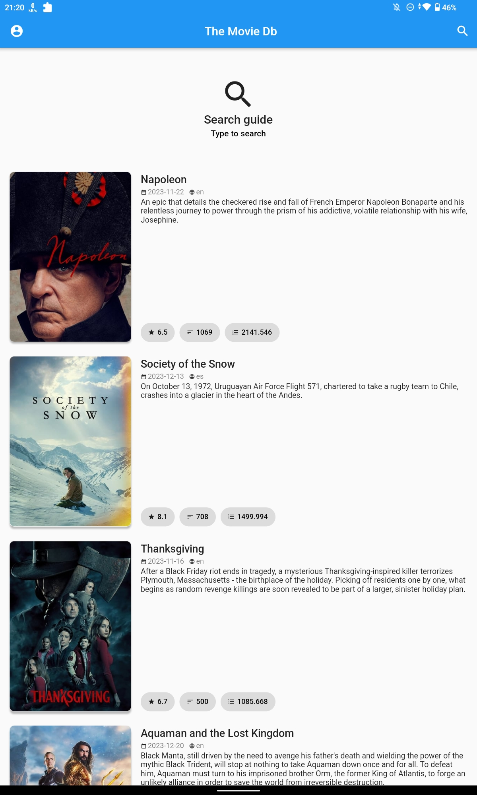
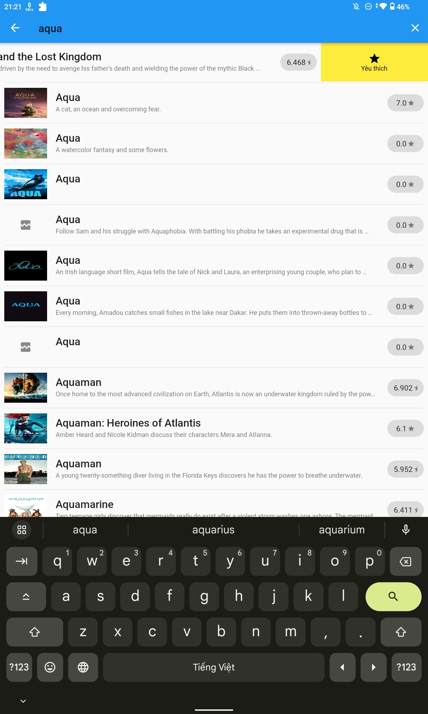
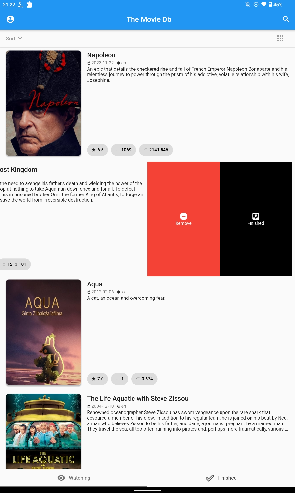
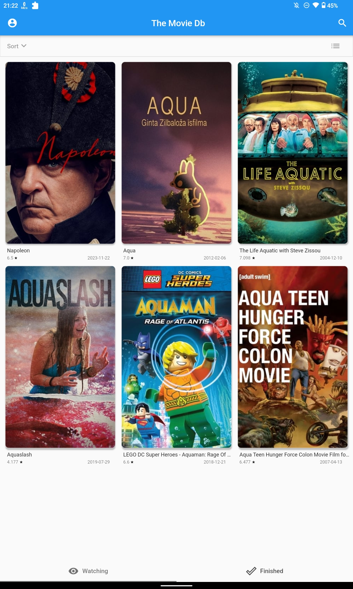
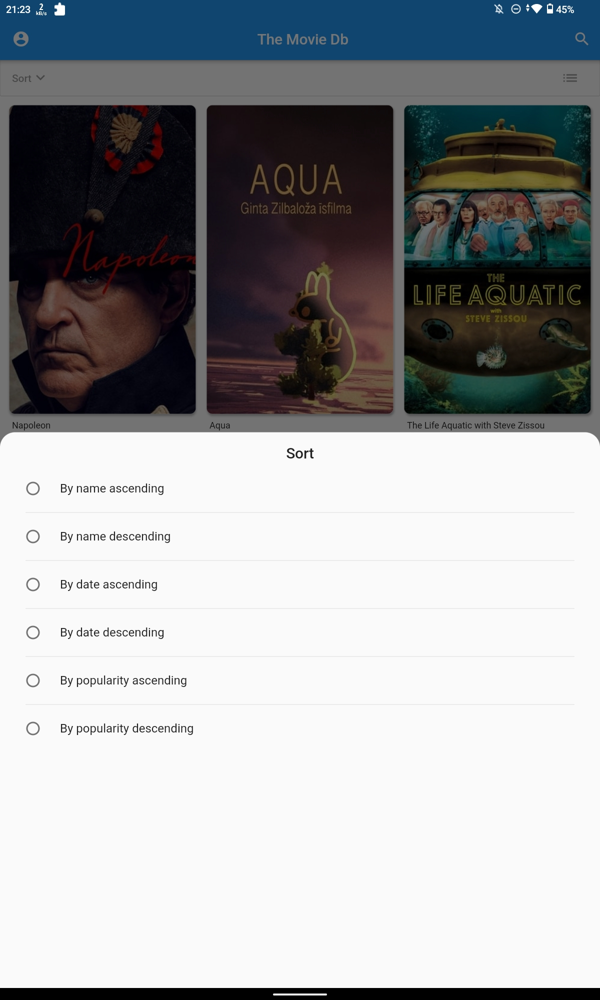
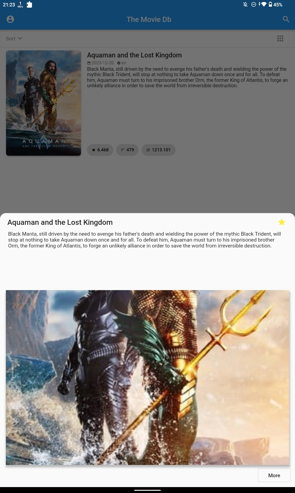
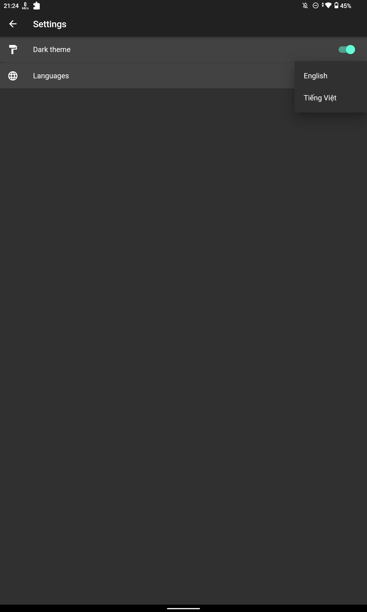
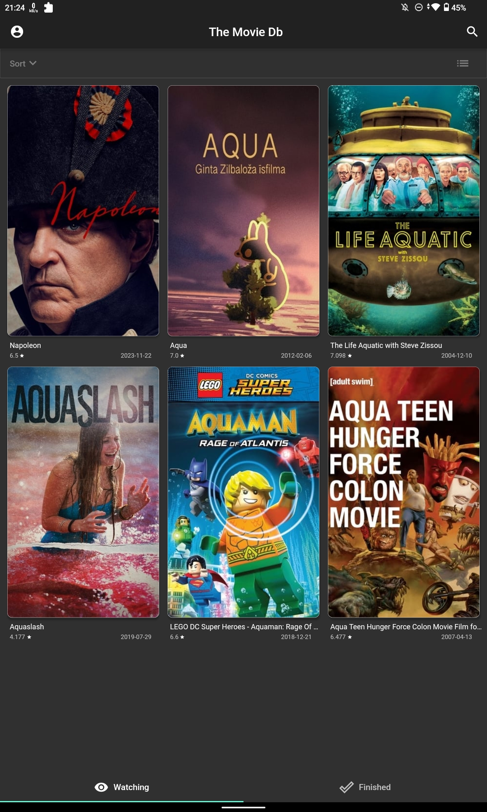

# project_movie_flutter

## Download
[Lastest release](https://github.com/nguyenhoangvannha/project_movie_flutter/releases/tag/v1.0)

## Screenshot
| | | |
|:-------------------------:|:-------------------------:|:-------------------------:|
|   |  ||
|  |  ||
|  |  ||

## Architecture
 
---
[Image Source](https://resocoder.com/2019/08/27/flutter-tdd-clean-architecture-course-1-explanation-project-structure/)

## Build apk
flutter pub get

flutter build apk --split-per-abi

## To gererate code
1. flutter packages pub run build_runner clean
2. flutter packages pub run build_runner build //watch (--delete-conflicting-outputs)
- flutter packages pub run build_runner build --delete-conflicting-outputs
